# Livepeer Video NFT Tutorial
---

This tutorial will help guide users through uploading and minting a video as an `NFT` using [Livepeer](https://livepeer.com/). 


## Table of Contents
<details>
<summary>Click to expand</summary>

- **Livepeer**
  - [Table of Contents](#table-of-contents)
  - [What is Livepeer?](#what-is-livepeer)
  - [What you need to get started](#what-you-need-to-get-started)
  - [Step 1: Get API Key](#step-1-get-api-key)
  - [Step 2: Setting up Livepeer CLI](step-2-setting-up-livepeer-cli)
  - [Step 3: Run the video-nft command](#step-3-run-the-video-nft-command)
  - [Step 4: Mint your Video NFT](#step-4-mint-your-video-nft)
  - [Building a dApp](#building-a-dapp)
</details>

### 📹 What is Livepeer? 📹
`Livepeer` is a decentralized video transcoding platform.

`Livepeer` makes adding video streaming features into your web3 apps easy. It can handle live streams or video files.

### What you need to get started:
* 💚 [Node. js](https://nodejs.org/en/) installed on your computer 💻
`node >=10.0.0` or `yarn >=1.0.0`
* [Yarn] 
* 📹 Have a `.mp4` video file to mint 🌿
* 🦊 [Metamask](https://metamask.io/download/) wallet 👛
* Have `Polygon/Mumbai Testnet` AND `MATIC` in your Metamask.


--- 
## ⬆️ Upload Your Video SDK ⬆️
### Step 1. Get API Key 🔑 
Get an `API key` from Livepeer [here](https://livepeer.com/dashboard/developers/api-keys)

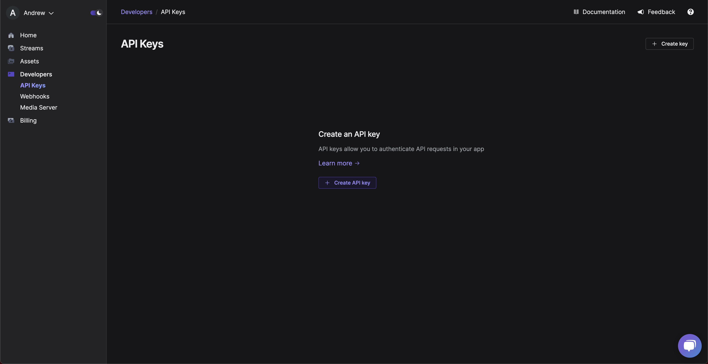

Click `Create API Key` 

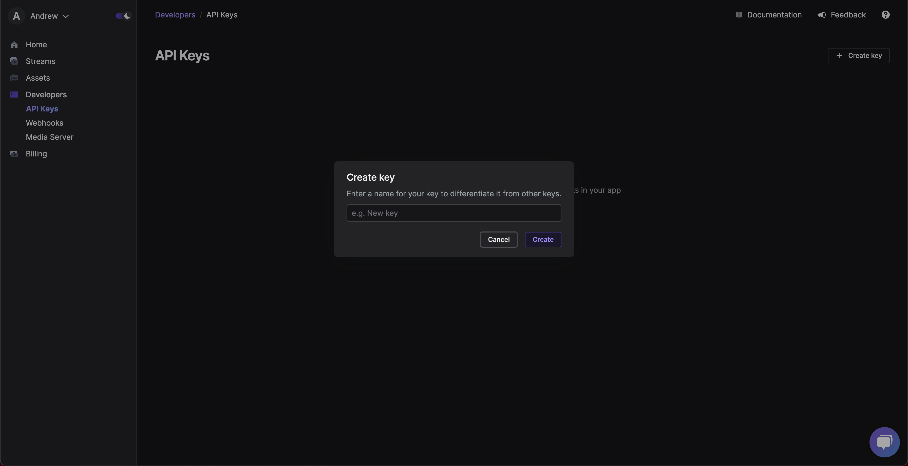

Enter the name for your `API key` and then Click `Create.`


The page should look like this when you create the  `API key`: 


---
### Step 2: Setting up Livepeer CLI
Navigate to a folder 📁 where your video file 🎥  is located 

* Example: `livepeer.mp4`

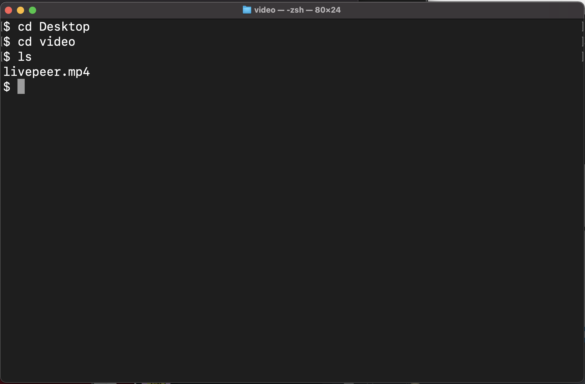

Run the following command in your terminal or command prompt to install the `Livepeer CLI` (Command Line Interface):

```bash
npm install -g @livepeer/video-nft
```

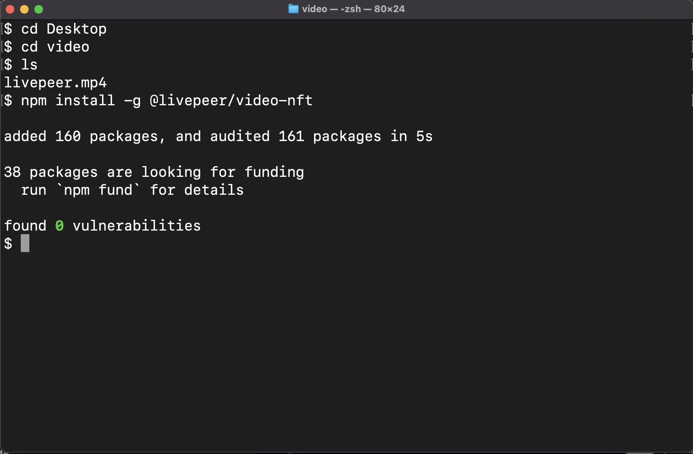

### Step 3. Run the `video-nft` command

Run the following command in your terminal: `video-nft.`

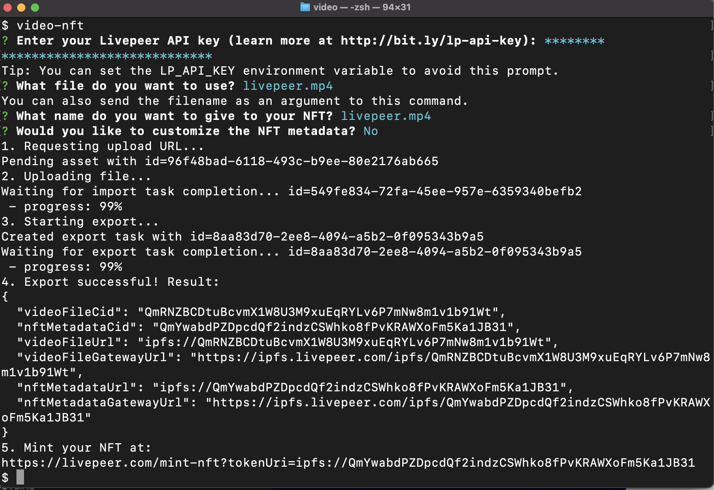

* Enter your `Livepeer API key.`

* Enter the name of the  `.mp4` file you want to use 

* Name you want to give to your NFT

* Optionally customize the metadata for your `video NFT` by hitting `Y` or `N.`

Once your video has successfully uploaded, you will get an object with fields, including your IPFS hash containing your metadata:

```JSON
{
  "videoFileCid": "QmRNZBCDtuBcvmX1W8U3M9xuEqRYLv6P7mNw8m1v1b91Wt",
  "nftMetadataCid": "QmYwabdPZDpcdQf2indzCSWhko8fPvKRAWXoFm5Ka1JB31",
  "videoFileUrl": "ipfs://QmRNZBCDtuBcvmX1W8U3M9xuEqRYLv6P7mNw8m1v1b91Wt",
  "videoFileGatewayUrl": "https://ipfs.livepeer.com/ipfs/QmRNZBCDtuBcvmX1W8U3M9xuEqRYLv6P7mNw8m1v1b91Wt",
  "nftMetadataUrl": "ipfs://QmYwabdPZDpcdQf2indzCSWhko8fPvKRAWXoFm5Ka1JB31",
  "nftMetadataGatewayUrl": "https://ipfs.livepeer.com/ipfs/QmYwabdPZDpcdQf2indzCSWhko8fPvKRAWXoFm5Ka1JB31"
}
```

The last line after the successful upload provides a URL like this: 

https://livepeer.com/mint-nft?tokenUri=ipfs://QmYwabdPZDpcdQf2indzCSWhko8fPvKRAWXoFm5Ka1JB31

A modal should popup:
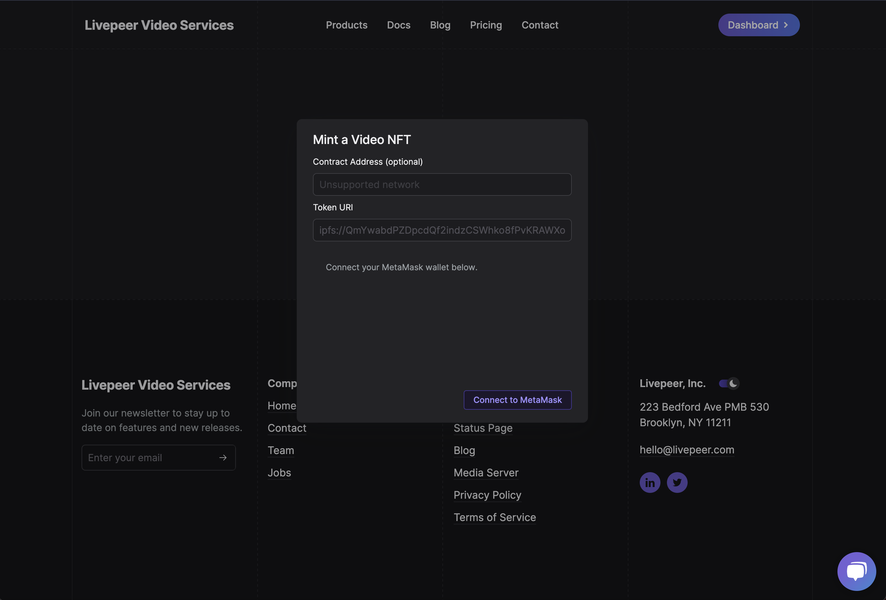

You can pass in your custom `ERC721 contract` address or use the contract provided by `Livepeer.`

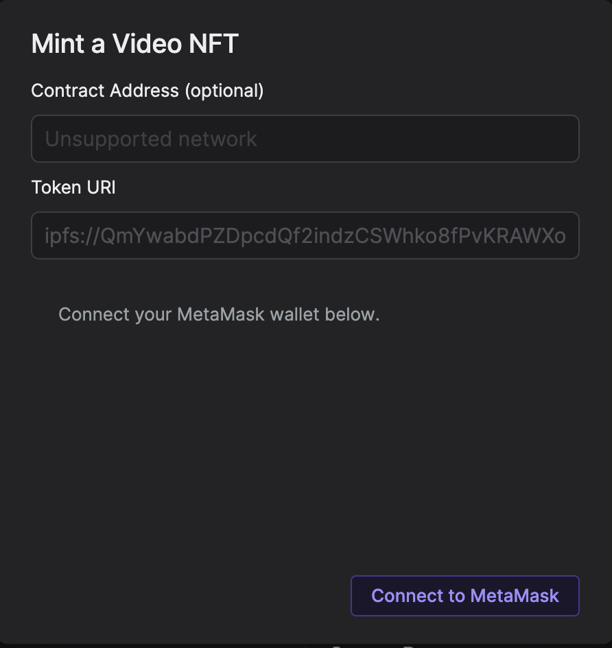

Click `Connect to Metamask` button
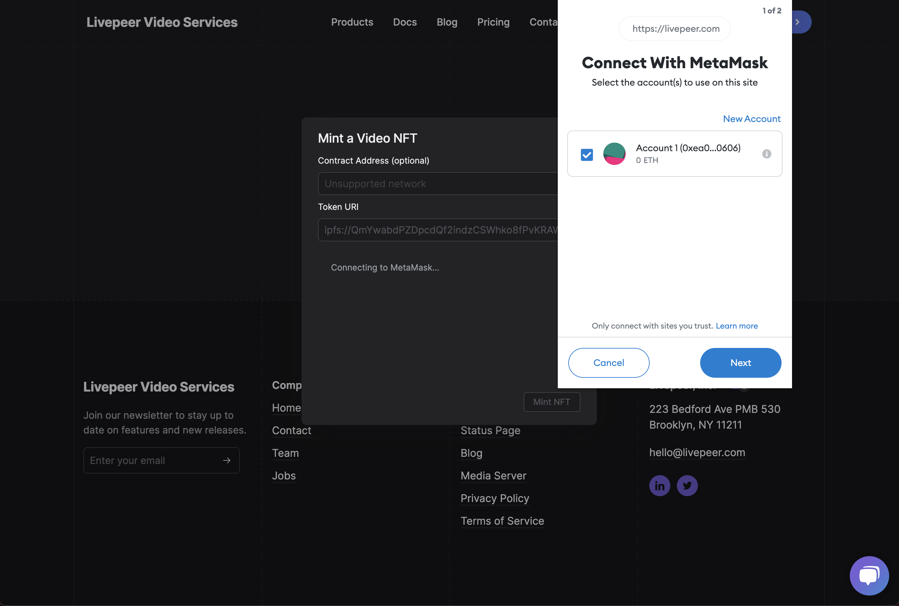

Choose either `Polygon Testnet` or `Polygon Mainnet.`

`Only Polygon network is supported right now.`


# Step 4. Mint your Video NFT

Prerequisite: 
* Be sure to have your `Metamask` network configured to the `Polygon Testnet` or  `Polygon Mainnet.`

 If you click on the button `Polygon Testnet` or `Polygon Mainnet,` it should configure your metamask to add and change your network. 

* Be sure to have some Matic Token in your `Metamask` wallet

#### Polygon Mainnet 
Polygon faucet can be found at https://matic.supply.

Make sure your `Metamask` or web 3.0 wallet is connected to the Polygon blockchain. 

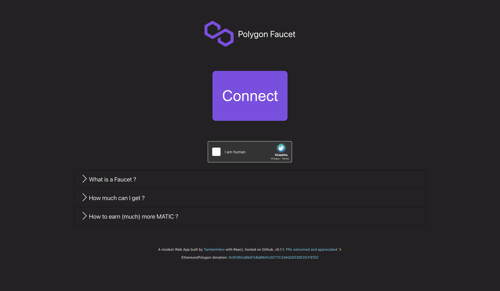


#### Polygon Testnet
If you need some Testnet Matic, go to this URL https://faucet.polygon.technology/. 

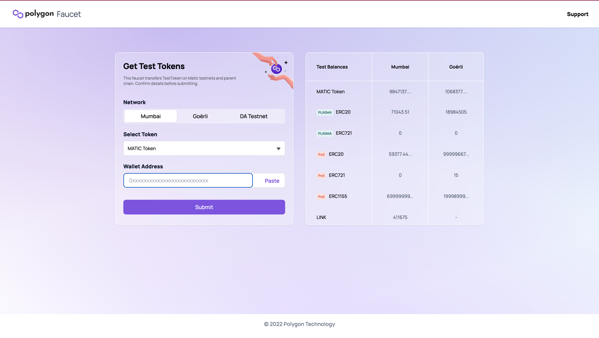

* After navigating to the URL provided, you can leave the contract field blank and default to Livepeer's contract. 

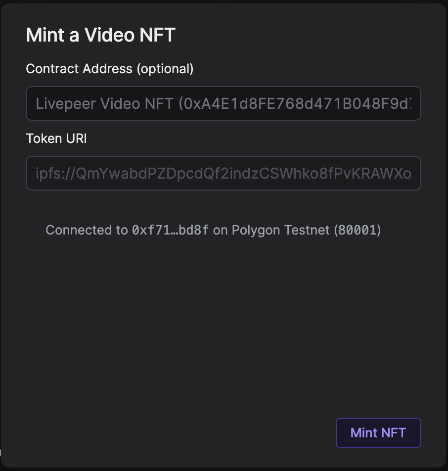

*  Hit `"Mint NFT"`

You'll have to confirm the transaction and pay for the gas in `Metamask`.


###  Congratulations 🎉

You just minted your nft! 

Click on the link `Check it out on OpenSea` to view your video NFT.

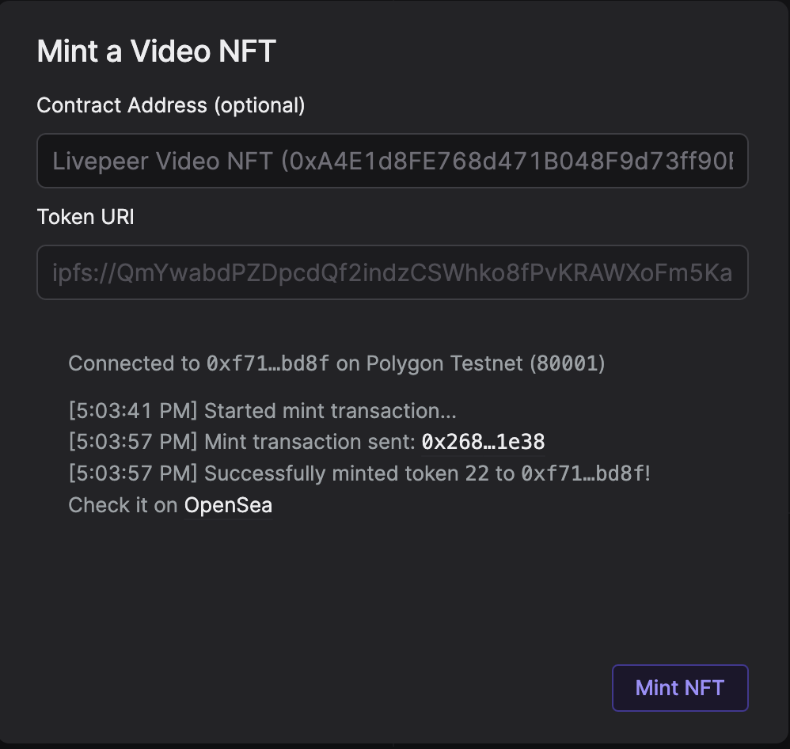

You can view the video nft from this tutorial rignt [here](https://testnets.opensea.io/assets/mumbai/0xA4E1d8FE768d471B048F9d73ff90ED8fcCC03643/21) 

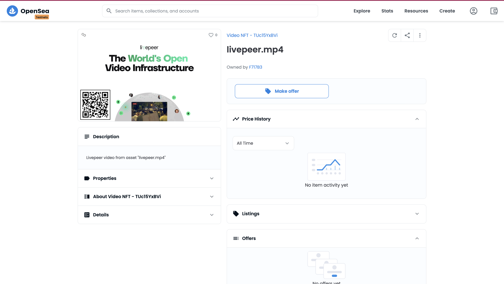

To view the metadata for this NFT, copy the IPFS hash provided to you in the terminal after uploading your video. 

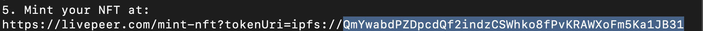

You can take this hash and navigate to https://ipfs.io/ipfs/your-ipfs-hash-here

Example: 
https://ipfs.io/ipfs/QmYwabdPZDpcdQf2indzCSWhko8fPvKRAWXoFm5Ka1JB31

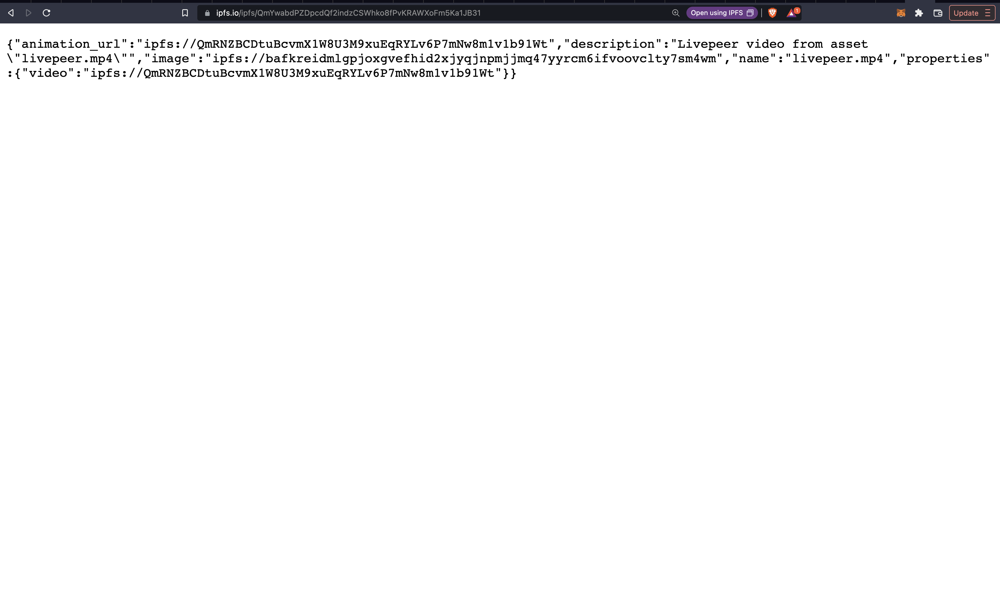


# Building a dApp using the SDK 

Lets build a video uploader that uses the sdk that you can later mint to polygon 

### Step 1. Setup Video NFT Backend Server
Create a folder  called `video-nft-server` 
```bash
mkdir video-nft-server
```

Next run these commands: 

#### npm
```bash
cd video-nft-server 
npm init 
```

#### yarn 
```bash
cd video-nft-server
yarn init
```


* Install the following npm packages to your package.json

#### npm
```bash
npm install --save @livepeer/video-nft cors dotenv express multer
```

#### yarn
```bash
yarn add @livepeer/video-nft cors dotenv express multer
````


### Step 2. Setup Video NFT SDK Frontend 


### Resources:


